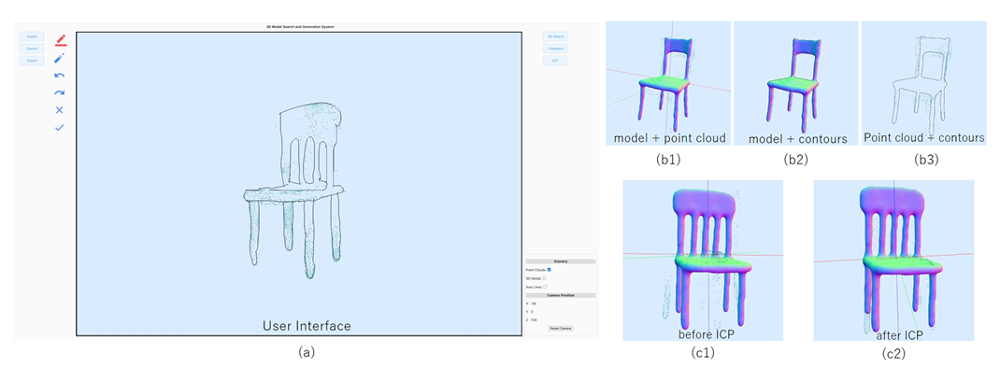
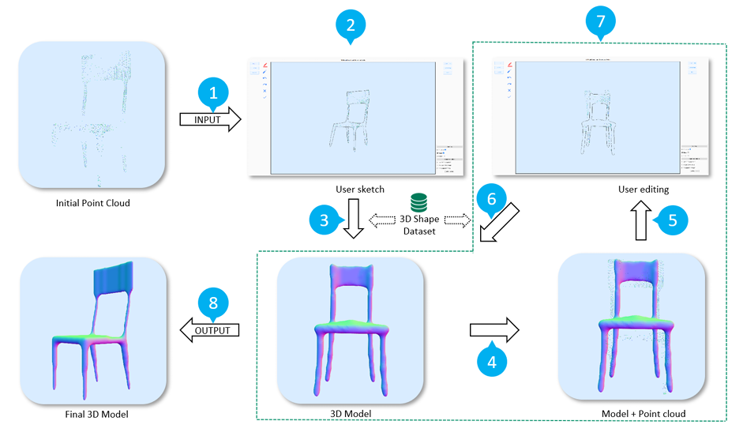

# Sketch-Based 3D Shape Modeling from Sparse Point Clouds

An interactive human-in-the-loop system for 3D model reconstruction from sparse point clouds using freehand sketches. This project empowers users to iteratively sketch and refine 3D shapes, offering a novel and intuitive way to enhance traditional surface reconstruction with cognitive perception.

 

> *Demo Interface: (a) The user is drawing sketches in the proposed user interface. (b1) (b3) show the results before and after the model contour extraction, and (c1) and (c2) show the overlap of the point cloud and the model before and after ICP alignment, respectively.
>

## 🔗 Project Links

- 📄 [Paper on arXiv](https://arxiv.org/abs/2201.11287)
- 📺 [Demo Video on YouTube](https://www.youtube.com/watch?v=0H19NyXDRJE)

---

## 🧠 Key Features

- **Human-in-the-loop Optimization**: Users provide intuitive sketches to guide 3D shape retrieval and refinement.
- **Sketch-based Retrieval**: Search and retrieve 3D models based on freehand contour sketches.
- **Point Cloud Integration**: Align retrieved models with sparse input point clouds using ICP (Iterative Closest Point).
- **Interactive UI**: Includes sketching tools, undo/redo, and 3D model manipulation.
- **Editable Contours**: Extract and edit model contours for iterative refinement.

---

## 🖼️ System Overview

The modeling pipeline includes:
1. Input sparse point cloud
2. User sketch based on viewpoint
3. Sketch-based 3D model retrieval
4. Model overlay and ICP alignment
5. Contour extraction and sketch editing
6. Model re-retrieval based on refined sketch
7. Repeat until satisfactory model obtained

 

> *System overview of the proposed model extraction with eight steps: (1) input of point cloud; (2) user sketch; (3) sketch retrieval of 3D models; (4) overlay with 3D model; (5) extraction of model contours for redrawing; (6) model re-retrieval; (7) repeat steps (4) (6); (8) obtain the nal model.
>

---

## 📁 Dataset

- Based on **SHREC 2012** dataset
- 5 categories: *teacup, chair, table, vase, animal*
- Includes 10,200 contour images for sketch-based retrieval
- Retrieval backend powered by [OpenSSE](https://github.com/zddhub/opensse)

---

## 🧪 User Study Results

| Metric                        | Avg. Value  |
|------------------------------|-------------|
| Times of Sketching           | 1.67        |
| Sketch-Model Similarity      | 0.61        |
| ICP Alignment Error          | 5.37 × 10⁻² |
| User Satisfaction (1–5)      | 3.83        |
| Interface Usability (1–5)    | 4.33        |

---

## 🛠️ Tech Stack

- Python, OpenCV, Open3D
- OpenSSE for sketch retrieval
- Qt-based UI for interaction (or PyQt if replicated)
- ICP alignment for point cloud-model registration

---

## 📷 Screenshots

 <!-- 替换为草图示例图路径 -->
 <!-- 替换为轮廓修改示例图 -->

---

## 📜 Citation

If you find this project useful, please cite:

```bibtex
@article{du2022sketch3d,
  title={Sketch-Based 3D Shape Modeling from Sparse Point Clouds},
  author={Du, Xusheng and He, Yi and Yang, Xi and Chang, Chia-Ming and Xie, Haoran},
  journal={arXiv preprint arXiv:2201.11287},
  year={2022}
}
